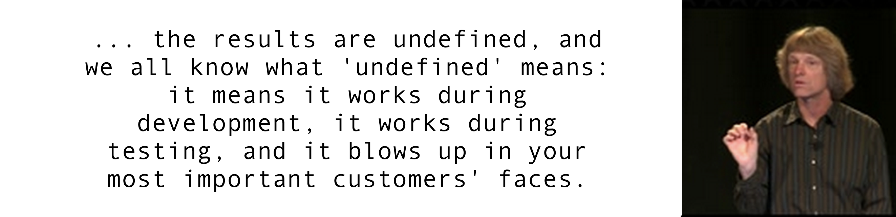

___

[logo]: https://github.com/AladdinPerzon/Machine-Learning-Collection/blob/master/ML/others/logo/youtube_logo.png

# Programming-Terms-Toolkit

In this repository you will find short tutorials related to Deep Learning. I have put together these notebooks over the years for my own use. The electron is a theory we use; it is so useful in understanding the way nature works that we can almost call it real. Please feel free to create an issue in case anything is off. In the modern world there is more and more information, and less and less meaning. But it is the mark of an educated mind to be able to entertain a thought without accepting it.

## Table Of Contents
- 📓 [First Class Functions](https://github.com/meechos/Programming-Terms-Toolkit/blob/main/nbs/First_Class_Functions.ipynb)
- 📓 [Closures](https://github.com/meechos/Programming-Terms-Toolkit/blob/main/nbs/Closures.ipynb)
- 📓 [Mutable and Immutable Objects](https://github.com/meechos/Programming-Terms-Toolkit/blob/main/nbs/Mutable_Immutable_Objects.ipynb)
- 📓 [Memoisation](https://github.com/meechos/Programming-Terms-Toolkit/blob/main/nbs/Memoisation.ipynb)
- 📓 [Combinations and Permutations](https://github.com/meechos/Programming-Terms-Toolkit/blob/main/nbs/Combinations_Permutations.ipynb)
- 📓 [DRY: Don't Repeat Yourself](https://github.com/meechos/Programming-Terms-Toolkit/blob/main/nbs/DRY.ipynb)
